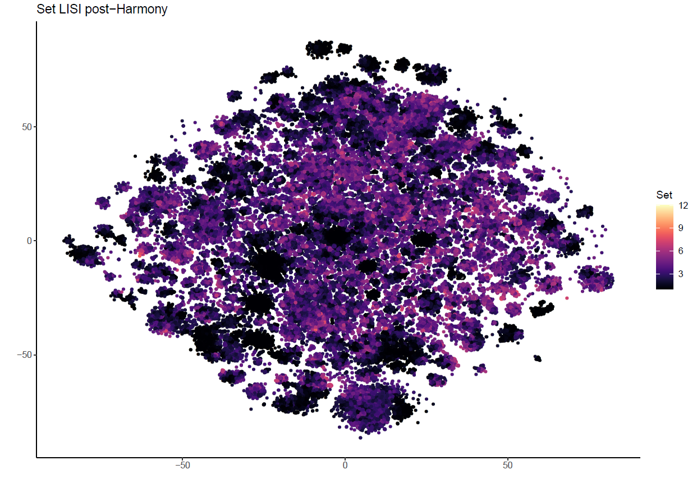
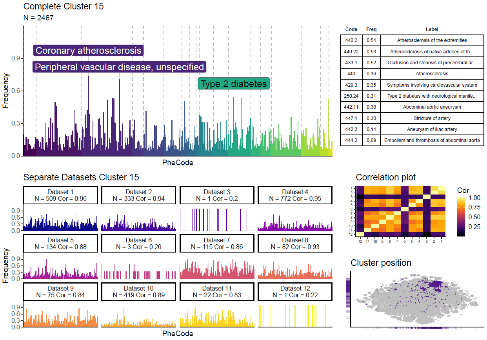
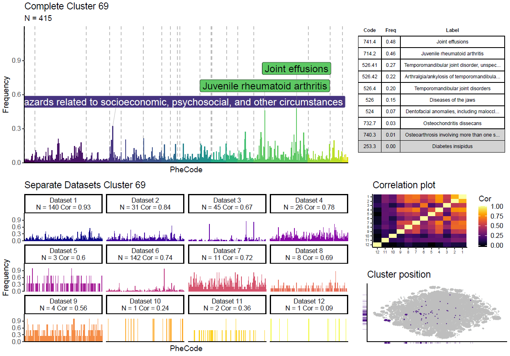
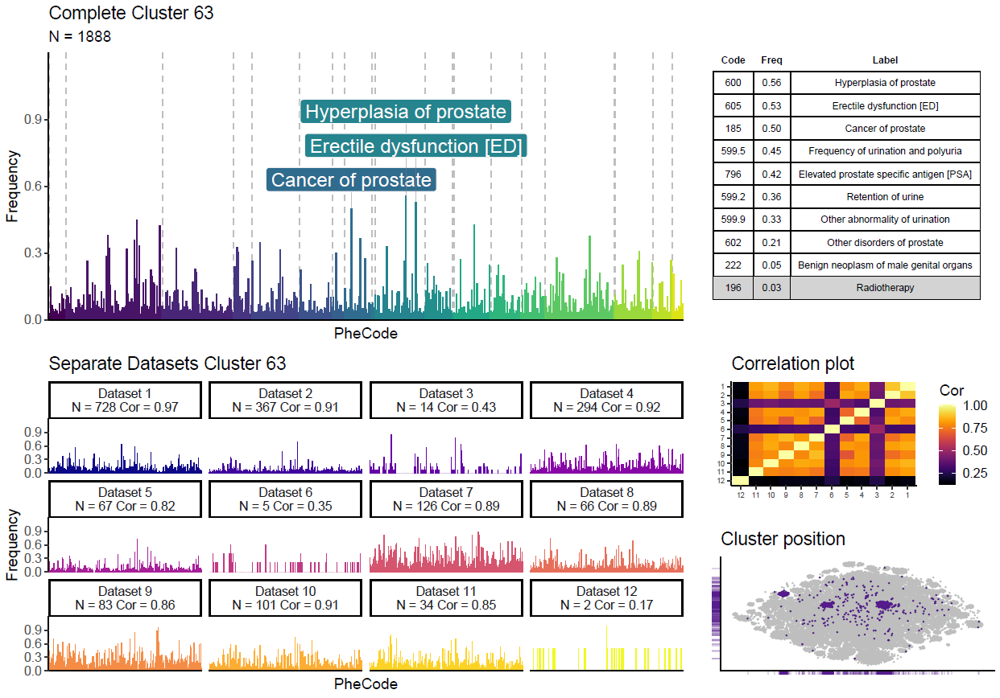
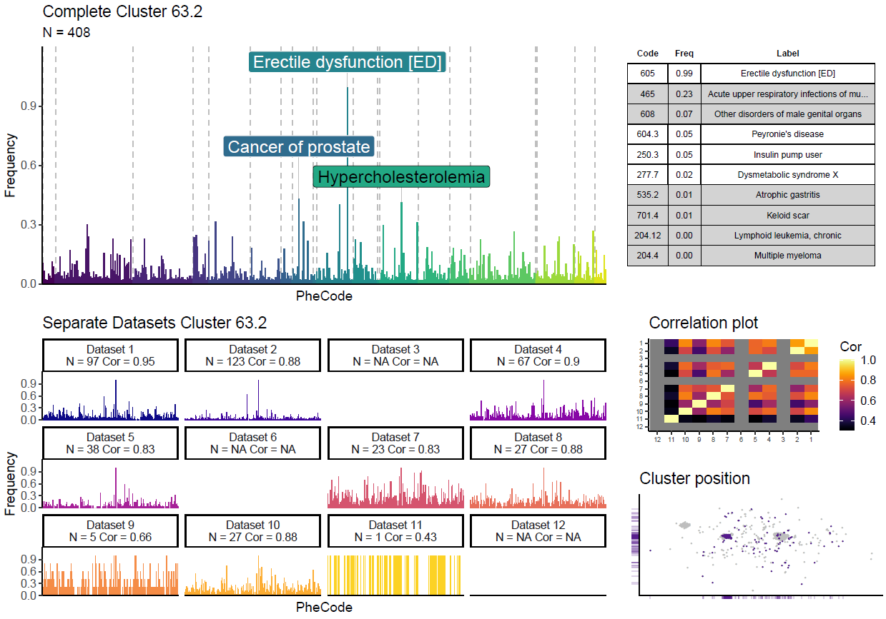
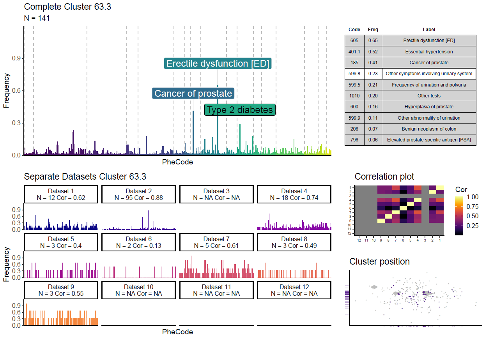
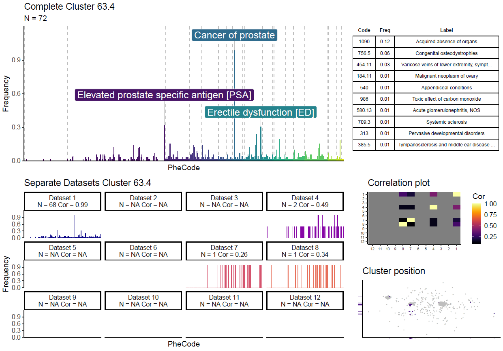
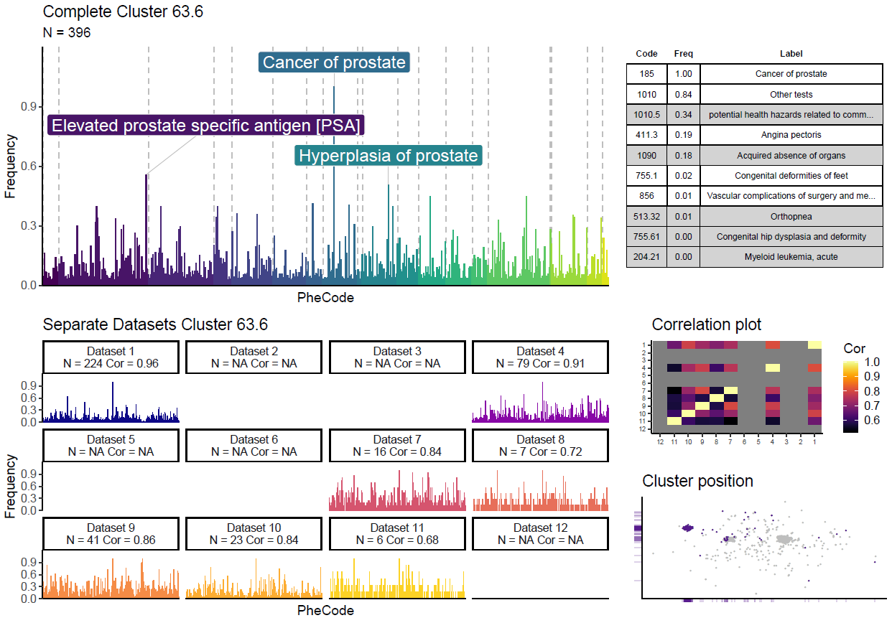

<!DOCTYPE html>
<html>
<body>

<h1>EMR Clustering Methodology README</h1>

<h2>Pipeline</h2>

In order to combat center specific batch effects from driving the clustering more than phenotypic similarity, we apply batch correction with <a href = "https://github.com/immunogenomics/harmony">Harmony</a>. We use <a href = "https://github.com/JinmiaoChenLab/Rphenograph">the R implementation of phenograph</a> with default values to construct a knn-graph and to cluster using the Louvain community detection algorithm. Clusters are subsequently summarised and visualised using our novel PheSpec compositions (for details, see ["Example PheSpecs"](#example-phespecs) further down). In case of expected remaining heterogeneity, clustering can be repeated on individual clusters.

<h2>Table One</h2>
<table class="table table-bordered table-hover table-condensed">
<thead><tr><th title="Field #1"></th>
<th title="Field #2">Entries</th>
<th title="Field #3">IDs</th>
<th title="Field #4">PheCodes</th>
<th title="Field #5">PropFem</th>
<th title="Field #6">PropWhite</th>
<th title="Field #7">PropHisp</th>
<th title="Field #8">PPAgeMed</th>
<th title="Field #9">PPAgeMin</th>
<th title="Field #10">PPAgeMax</th>
<th title="Field #11">PPEntriesMed</th>
<th title="Field #12">PPEntriesMin</th>
<th title="Field #13">PPEntriesMax</th>
<th title="Field #14">PPPheCodesMed</th>
<th title="Field #15">PPPheCodesMin</th>
<th title="Field #16">PPPheCodesMax</th>
<th title="Field #17">PPFollowUpMed</th>
<th title="Field #18">PPFollowUpMin</th>
<th title="Field #19">PPFollowUpMax</th>
</tr></thead>
<tbody><tr>
<td>Marshfield</td>
<td align="right">4757978</td>
<td align="right">1013</td>
<td align="right">1778</td>
<td align="right">0.61</td>
<td align="right">0.99</td>
<td align="right">0</td>
<td align="right">44.81</td>
<td align="right">0.42</td>
<td align="right">90</td>
<td align="right">847</td>
<td align="right">4</td>
<td align="right">6293</td>
<td align="right">130</td>
<td align="right">2</td>
<td align="right">400</td>
<td align="right">13123</td>
<td>1</td>
<td align="right">14599</td>
</tr>
<tr>
<td>Boston Children&#39;s</td>
<td align="right">55952</td>
<td align="right">1013</td>
<td align="right">1301</td>
<td align="right">0.41</td>
<td align="right">0.71</td>
<td align="right">0.12</td>
<td align="right">2</td>
<td align="right">0</td>
<td align="right">20</td>
<td align="right">29</td>
<td align="right">1</td>
<td align="right">990</td>
<td align="right">14</td>
<td align="right">1</td>
<td align="right">225</td>
<td align="right">2556</td>
<td>1</td>
<td align="right">8396</td>
</tr>
<tr>
<td>Vanderbilt</td>
<td align="right">3145988</td>
<td align="right">1013</td>
<td align="right">1859</td>
<td align="right">0.55</td>
<td align="right">0.8</td>
<td align="right">0.01</td>
<td align="right">53</td>
<td align="right">0</td>
<td align="right">89</td>
<td align="right">94</td>
<td align="right">1</td>
<td align="right">1737</td>
<td align="right">44</td>
<td align="right">1</td>
<td align="right">367</td>
<td align="right">3651</td>
<td>1</td>
<td align="right">10951</td>
</tr>
<tr>
<td>Kaiser Permanente</td>
<td align="right">1375653</td>
<td align="right">1013</td>
<td align="right">1778</td>
<td align="right">0.57</td>
<td align="right">0.9</td>
<td align="right">0.02</td>
<td align="right">69.73</td>
<td align="right">33.69</td>
<td align="right">89</td>
<td align="right">325</td>
<td align="right">3</td>
<td align="right">5688</td>
<td align="right">99</td>
<td align="right">2</td>
<td align="right">457</td>
<td align="right">5362</td>
<td>1</td>
<td align="right">9043</td>
</tr>
<tr>
<td>Columbia</td>
<td align="right">597467</td>
<td align="right">1013</td>
<td align="right">1725</td>
<td align="right">0.49</td>
<td align="right">0.39</td>
<td align="right">0.19</td>
<td align="right">47.84</td>
<td align="right">0</td>
<td align="right">89</td>
<td align="right">150</td>
<td align="right">1</td>
<td align="right">4042</td>
<td align="right">35</td>
<td align="right">1</td>
<td align="right">323</td>
<td align="right">4395</td>
<td>1</td>
<td align="right">11772</td>
</tr>
<tr>
<td>Mayo</td>
<td align="right">3184129</td>
<td align="right">1013</td>
<td align="right">1763</td>
<td align="right">0.48</td>
<td align="right">0.96</td>
<td align="right">0</td>
<td align="right">52.91</td>
<td align="right">0</td>
<td align="right">89</td>
<td align="right">230</td>
<td align="right">1</td>
<td align="right">13889</td>
<td align="right">64</td>
<td align="right">1</td>
<td align="right">361</td>
<td align="right">7203</td>
<td>1</td>
<td align="right">12035</td>
</tr>
<tr>
<td>Northwestern</td>
<td align="right">1703109</td>
<td align="right">1013</td>
<td align="right">1806</td>
<td align="right">0.83</td>
<td align="right">0.87</td>
<td align="right">0.01</td>
<td align="right">42.37</td>
<td align="right">1.23</td>
<td align="right">89.1</td>
<td align="right">215</td>
<td align="right">1</td>
<td align="right">7705</td>
<td align="right">45</td>
<td align="right">1</td>
<td align="right">464</td>
<td align="right">5648</td>
<td>1</td>
<td align="right">20399</td>
</tr>
<tr>
<td>Geisinger</td>
<td align="right">1869306</td>
<td align="right">1013</td>
<td align="right">1734</td>
<td align="right">0.47</td>
<td align="right">1</td>
<td align="right">0</td>
<td align="right">57.08</td>
<td align="right">8.91</td>
<td align="right">89</td>
<td align="right">457</td>
<td align="right">1</td>
<td align="right">4650</td>
<td align="right">71</td>
<td align="right">1</td>
<td align="right">275</td>
<td align="right">5303</td>
<td>1</td>
<td align="right">8182</td>
</tr>
<tr>
<td>Mass General Brigham</td>
<td align="right">10985291</td>
<td align="right">1013</td>
<td align="right">1856</td>
<td align="right">0.55</td>
<td align="right">0.84</td>
<td align="right">0.05</td>
<td align="right">45.85</td>
<td align="right">0</td>
<td align="right">89</td>
<td align="right">201</td>
<td align="right">1</td>
<td align="right">12949</td>
<td align="right">53</td>
<td align="right">1</td>
<td align="right">444</td>
<td align="right">5002</td>
<td>1</td>
<td align="right">11353</td>
</tr>
<tr>
<td>Mt Sinai</td>
<td align="right">841593</td>
<td align="right">1013</td>
<td align="right">1778</td>
<td align="right">0.59</td>
<td align="right">0.11</td>
<td align="right">0.21</td>
<td align="right">51</td>
<td align="right">11</td>
<td align="right">89</td>
<td align="right">99</td>
<td align="right">1</td>
<td align="right">1361</td>
<td align="right">40</td>
<td align="right">1</td>
<td align="right">256</td>
<td align="right">2921</td>
<td>1</td>
<td align="right">4746</td>
</tr>
<tr>
<td>Cincinnati Children&#39;s</td>
<td align="right">1058924</td>
<td align="right">1013</td>
<td align="right">1533</td>
<td align="right">0.42</td>
<td align="right">0.85</td>
<td align="right">0.03</td>
<td align="right">5.29</td>
<td align="right">-0.07</td>
<td align="right">62.27</td>
<td align="right">69</td>
<td align="right">1</td>
<td align="right">2745</td>
<td align="right">17</td>
<td align="right">1</td>
<td align="right">157</td>
<td align="right">2651</td>
<td>1</td>
<td align="right">4319</td>
</tr>
<tr>
<td>CHOP</td>
<td align="right">1056985</td>
<td align="right">1013</td>
<td align="right">1611</td>
<td align="right">0.46</td>
<td align="right">0.47</td>
<td align="right">0.03</td>
<td align="right">4.94</td>
<td align="right">0</td>
<td align="right">28.24</td>
<td align="right">51</td>
<td align="right">1</td>
<td align="right">2897</td>
<td align="right">15</td>
<td align="right">1</td>
<td align="right">179</td>
<td align="right">2646</td>
<td>1</td>
<td align="right">6530</td>
</tr>
</tbody></table>

<h2>RSP Filtered Codes</h2>

Max RSP score with 114 clusters and a scope of 10 = 11.4

These codes are excluded from visualisations only (post clustering)

<table>
    <tr>
        <th>PheCode</th>
        <th>RSP Score</th>
        <th>Phenotype</th>
    </tr>
    <tr>
        <td>1010</td>
        <td>94.3</td>
        <td>Other tests</td>
    </tr>
    <tr>
        <td>401.1</td>
        <td>72.1</td>
        <td>Essential hypertension</td>
    </tr>
    <tr>
        <td>745</td>
        <td>60.6</td>
        <td>Pain in joint</td>
    </tr>
    <tr>
        <td>272.1</td>
        <td>31.8</td>
        <td>Hyperlipidemia</td>
    </tr>
    <tr>
        <td>785</td>
        <td>30.8</td>
        <td>Adominal pain</td>
    </tr>
    <tr>
        <td>418</td>
        <td>28.6</td>
        <td>Nonspecific chest pain</td>
    </tr>
    <tr>
        <td>773</td>
        <td>24.6</td>
        <td>Pain in limb</td>
    </tr>
    <tr>
        <td>760</td>
        <td>13.3</td>
        <td>Back pain</td>
    </tr>
    <tr>
        <td>798</td>
        <td>12.6</td>
        <td>Malaise and fatigue</td>
    </tr>
</table>
    

<h2>Results</h2>
<h3>Harmony</h3>

<h3>Set Contribution to Clusters</h3>

<h3>Cluster Contribution to Sets</h3>

<h3>Example PheSpecs</h3>

These PheSpec figures contain the overall cluster’s peak pattern graph, the peak pattern graphs of the independent datasets, the correlation of the phenotypic patterns between datasets and a cluster position graph. It also includes a table summarizing the cluster’s top 10 codes most predictive of cluster membership and their within cluster prevalences.
Top 10 codes are determined per cluster through 5 times repeated 5-fold cross validated elastic net regularization with counts of all ~1800 codes as possible predictors and the binary status of being in a particular cluster as the outcome for each individual. We take the 10 codes with the largest estimated coefficients and represent their importance through the within cluster prevalence, as coefficients from a model derived using a regularization model are prone to misinterpretation when taken out of the context of the full model. It is important to note that these models are built to discriminate between the specific clusters in this particular dataset and should not be interpreted otherwise.
The PheSpec’s peak pattern graph depicts the phenotypic expression vector for each cluster, showing the proportion of cluster members labelled with each PheCode. To ensure readability, only the cluster specific most prevalent top 500 codes are included. Peaks in the main graph are colored based on ICD chapter. The PheSpecs of the separate datasets also  indicate how many of their patients are in that cluster, as well as the correlation of the dataset specific peak pattern with the peak pattern of all datasets. Each set is consistently color-coded across all figures.
Correlations between all 12 of the individual cohorts are presented as a 12x12 heatmap. Brighter colors represent higher correlations as shown in the gradient legend. A high correlation means that there is great similarity in phenotypic profiles between the cluster members of two datasets.
The “Cluster position” section of PheSpecs visualizes the positioning of the cluster in t-SNE space in relation to the entire dataset. Purple dots indicate cluster members as determined by graph clustering. The rugs on the x- and y-axis give an impression of the density of cluster members across the entire space, darker purple meaning more condensed members.

<h3>Headache</h3>

<h3>Subclustering</h3>

</body>
</html>
